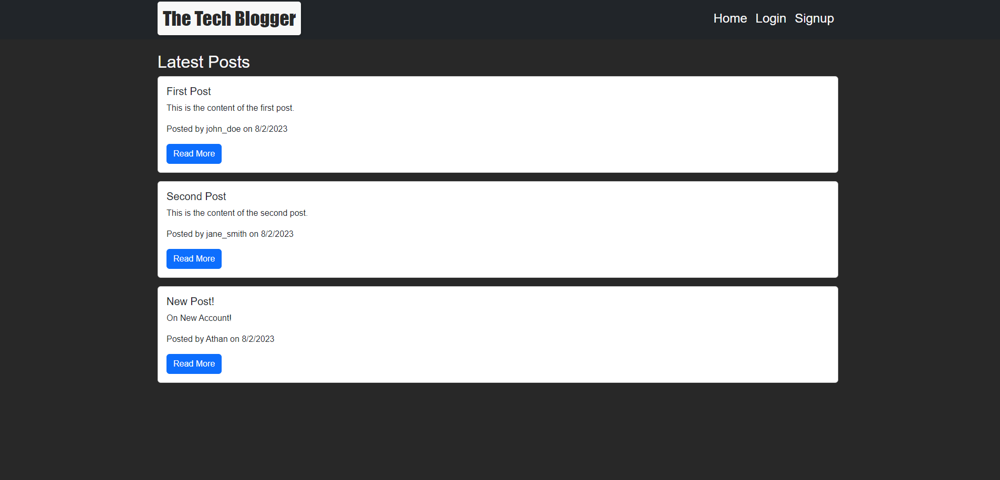
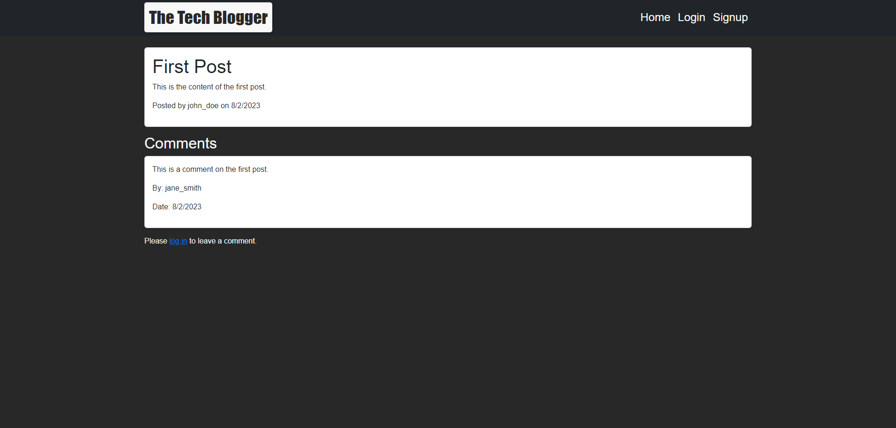
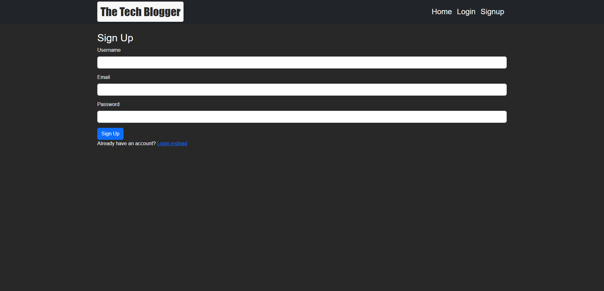
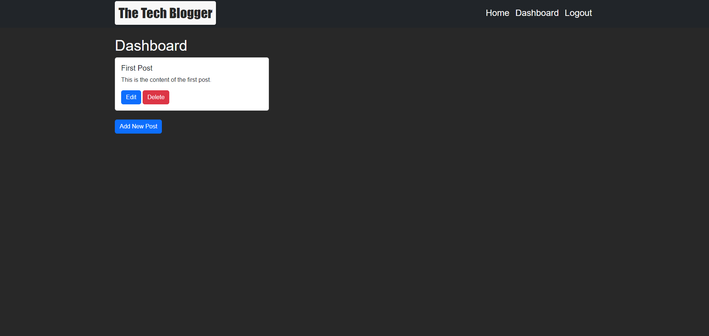

# The-Tech-Blogger

## Description
The Tech Blogger is an interactive blogging platform designed specifically for tech enthusiasts. It provides a space for users to share their thoughts, insights, and opinions on various tech-related topics. Users can create an account, write their own blog posts, and comment on others' posts, fostering an engaging community dialogue.  
 
Built with Node.js, Express.js, and MySQL, the application utilizes a MVC (Model-View-Controller) structure to separate the concerns of data handling, user interface, and control flow. It leverages Sequelize for database management and Express Handlebars as a template engine for generating HTML.  
 
Additionally, the application includes user authentication to ensure data security and integrity. It has been deployed on Heroku with JawsDB for online persistent storage.  
 
Whether you're an experienced tech professional, a hobbyist, or a beginner just starting your journey, The Tech Blogger is a great platform to share your insights and learn from the community. 

## Table of Contents
- [Installation](#installation)
- [Usage](#usage)
- [License](#license)
- [Contributing](#contribution)
- [Tests](#tests)
- [Previews](#previews)
- [Links](#links)
- [Credits](#credits)
- [Questions](#questions)
  
## Installation
Follow these instructions:  
1. Git clone this repository.  
2. Install [Node](https://nodejs.org/en).  
3. Install necessary modules by using command: npm install  
4. Setup SQL database using schema.sql file.  
5. Use any git terminal like Git Bash or Visual Studio Code. 
6. Use this command line to inject content into database: npm run seed  
7. If you want to start the server locally through a command: node server.js or npm start  
8. Use API call websites like Postman or Insomnia to get the database.  
  
## Usage
A CMS-style blog site similar to a Wordpress site, where developers can publish their blog posts and comment on other developers’ posts as well.
  
## License
This project is licensed under the MIT license.
  
## Contribution
Please use proper general rules for contribution and merging. Always git pull before you git push your changes. And no merge conflicts please.  
  
## Previews

  
  
  
  

## Tests
Use this command to test:  
node server.js  
or  
npm start  

Use API call websites like Postman or Insomnia to get the database. 

## Links
**Github Repo:** [Link to Github repository!](https://github.com/Heaveness/the-tech-blogger)  
**Heroku App:** [Link to the Heroku App!](https://the-tech-blogger-heaveness-7bf39de84259.herokuapp.com/)  

## Credits
**Websites:** W3schools, stackoverflow, & reddit  
**Instructor(s):** Ali Maqsood, Daler Singh  
**Assistant Instructor(s):** Shihan, Adam, Krishna, & Tareque Moatar  
**Institution:** University of Toronto  

## Questions
If you have any questions regarding the repo, please contact me at vindictuslbp@gmail.com. Or check with me through my Github profile: [Heaveness](https://github.com/Heaveness).